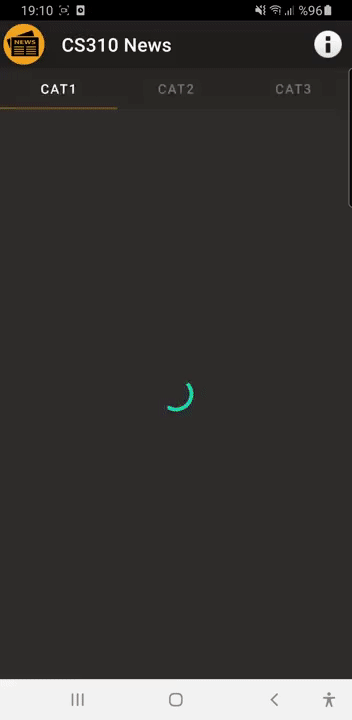

# NewsApp
The app is written in Java and built with Gradle on Android Studio. It gets data of the news from a local database.

<table style="width:100%">
  <tr>
    <td></td>
    <td></td>
    <td></td>
    <td></td>
    <td></td>
    <td></td>
  </tr>
</table>
